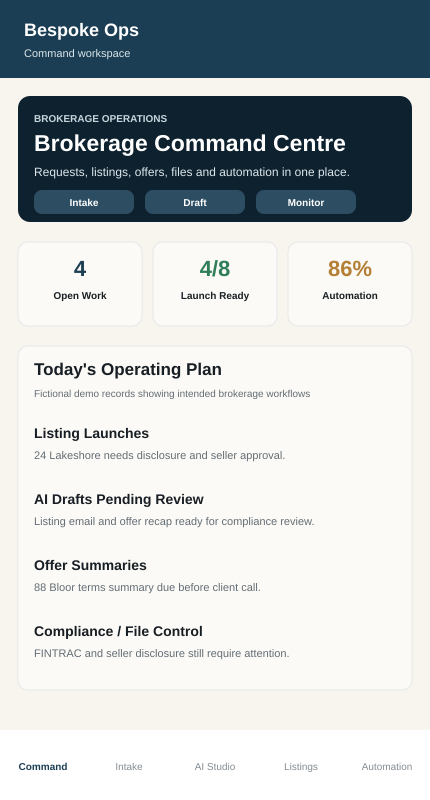
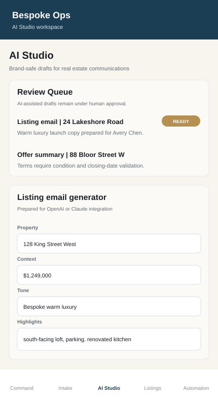
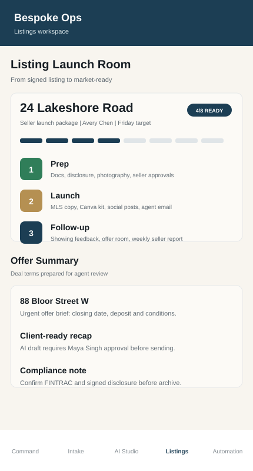
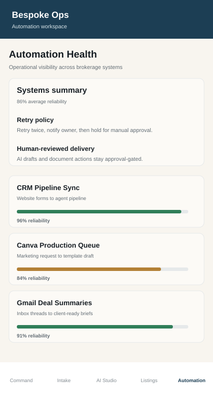

# Bespoke Ops

**A native Android operations prototype for coordinating real estate brokerage workflows, approvals, AI-assisted drafting, listing launches, and automation health.**

Bespoke Ops is designed as an internal command centre for brokerage staff. The app brings agent requests, listing preparation, offer review, file-control reminders, AI draft approvals, and connected-system monitoring into one mobile workflow instead of scattering operational work across inboxes, spreadsheets, design tools, and automation dashboards.

The prototype is built as a **native Java Android application** and includes a directly installable demo APK.

## Demo APK

**[Download BespokeOps-demo-release.apk](https://github.com/Kyla-Zeit/BespokeOpsAndroid/raw/main/BespokeOps-demo-release.apk)**

Install the APK on an Android phone or tablet, then open **Bespoke Ops**. Demo records are fictional and no production credentials or private client data are included.

## Product preview

<p align="center">
  
  &nbsp;&nbsp;
  
</p>

<p align="center">
  <strong>Command Centre</strong> — open work, listing readiness, priority operations, and brokerage-wide visibility.<br/>
  <strong>AI Studio</strong> — human-reviewed drafting workflows for listing, offer, and client communications.
</p>

<p align="center">
  
  &nbsp;&nbsp;
  
</p>

<p align="center">
  <strong>Listing Launch Room</strong> — preparation stages, offer summaries, approvals, and compliance/file-control checks.<br/>
  <strong>Automation Health</strong> — operational visibility for CRM, Gmail, Canva, Sheets, browser automation, and other workflow systems.
</p>

> The portfolio previews above are source-faithful visualizations based directly on the current native Android UI, seeded demo records, labels, and colour system. The installable APK remains the authoritative interactive demo.

## Product at a glance

| Area | Implementation |
| --- | --- |
| Platform | Native Android |
| Language | Java |
| UI | Programmatic Android Views and custom drawing |
| Android target | API 35 |
| Minimum Android | API 26 |
| Demo distribution | Installable APK included in repository |
| Workflow model | In-memory fictional brokerage records for demonstration |
| AI layer | Human-reviewed prototype flow prepared for OpenAI or Claude integration |
| Connected systems | CRM, Gmail, Google Sheets/Drive, Canva, n8n, Make, Zapier, Playwright concepts |
| Privacy posture | No private client data or credentials; Android backup disabled |

## Operating workflow

```text
Agent / Staff Request
        ↓
Request Intake + Priority
        ↓
Operations Queue
        ↓
Listing / Offer / Marketing Workflow
        ↓
AI-Assisted Draft or Automation Handoff
        ↓
Human Review / Approval
        ↓
Delivery + File Control + Operational Visibility
```

## Core workspaces

### Command Centre

The home workspace gives operations staff a compact view of current brokerage activity:

- Open agent work and priority requests
- Listing-launch readiness
- AI drafts awaiting review
- Offer-summary deadlines
- Marketing queue visibility
- Compliance and file-control reminders
- Automation reliability and recent incidents

### Request Intake

Structured intake captures the information needed to route work consistently:

- Agent and request type
- Priority
- Property or client subject
- Supporting notes
- Intended systems such as Canva, Instagram, Gmail, CRM, Sheets, Drive, Docs, or browser automation
- Queue status and ownership context

### AI Studio

AI Studio models an approval-first content workflow rather than unsupervised generation.

The prototype includes:

- Listing-email drafting
- Offer-summary review
- Seller-update workflow concepts
- Tone selection and reusable prompt context
- Draft preview and copy actions
- Explicit human approval before client delivery

The current demo generates local prototype copy. A production implementation could replace that layer with OpenAI or Claude while preserving review history and approval controls.

### Listing Launch Room

Listing operations are organized around visible stages and file-control requirements:

- Preparation, launch, and follow-up stages
- Seller launch package status
- Offer-summary review
- Compliance reminders
- FINTRAC and disclosure checkpoints
- Photography and marketing readiness
- Presentation-packet workflow concepts

### Automation Health

The monitoring workspace models how brokerage automations could be surfaced to operations staff without requiring them to inspect several external tools individually.

Demo systems include:

- CRM Pipeline Sync
- Canva Production Queue
- Gmail Deal Summaries
- Google Sheets Ledger
- Playwright Portal Tasks

Each automation exposes a reliability score and operating state, alongside retry/manual-review concepts and an incident feed.

## Design and UX

The interface uses a restrained brokerage-oriented visual system built directly in Android:

- Deep navy operational navigation
- Ivory and paper-like surfaces
- Brass accents for premium/attention states
- Sage/green success indicators
- Restrained warning and error colours
- Portrait-first mobile layout
- Consistent status pills, cards, workflow stages, and bottom navigation

The app intentionally avoids live font-provider dependencies for the demo and uses Android-native font equivalents.

## Architecture

The current prototype is deliberately self-contained.

```text
MainActivity
   ├── Seeded Workflow Data
   │    ├── Requests
   │    ├── Automation Jobs
   │    └── Incidents
   │
   ├── Command Workspace
   ├── Intake Workspace
   ├── AI Studio
   ├── Listings Workspace
   └── Automation Workspace
```

Most UI is assembled programmatically in `MainActivity.java`, including reusable panels, cards, pills, dialogs, progress indicators, navigation elements, and custom-drawn icons. This keeps the portfolio APK self-contained while still demonstrating a complete operations workflow.

## Repository structure

```text
BespokeOpsAndroid/
├── BespokeOps-demo-release.apk
├── README.md
├── docs/
│   └── assets/
└── android/
    ├── app/
    │   ├── build.gradle
    │   └── src/main/
    │       ├── AndroidManifest.xml
    │       ├── java/com/bespoke/realops/MainActivity.java
    │       └── res/
    ├── build.gradle
    ├── gradle/
    └── gradlew
```

## Build

The Android project includes its Gradle wrapper.

```bash
cd android
./gradlew assembleDebug
```

The repository also contains a signed-with-debug-key **demo** build variant used for portfolio distribution.

## Demo boundaries

Bespoke Ops is a portfolio prototype, not a production brokerage platform.

- All displayed brokerage records are fictional.
- CRM, Gmail, Sheets, Drive, Canva, n8n, Make, Zapier, Playwright, OpenAI, and Claude are represented as integration targets/workflow concepts unless explicitly implemented in a future production adapter.
- No private client data, API keys, tokens, or credentials are included.
- Android backup is disabled in the application manifest.
- AI-generated client communication is designed around human review before delivery.

## Why this project exists

Real estate operations often span inboxes, spreadsheets, listing systems, design tools, compliance checklists, and automation platforms. Bespoke Ops explores what that work looks like when it is treated as **one coordinated operating system** with clear ownership, approvals, status, and next actions.
